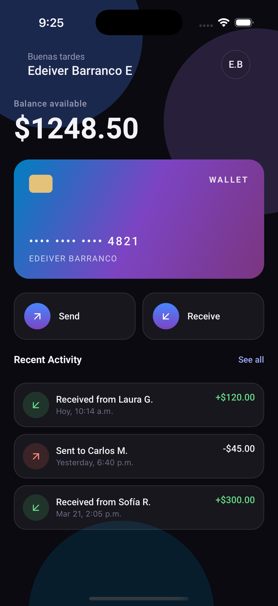
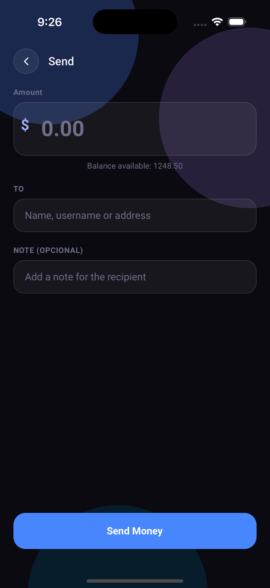
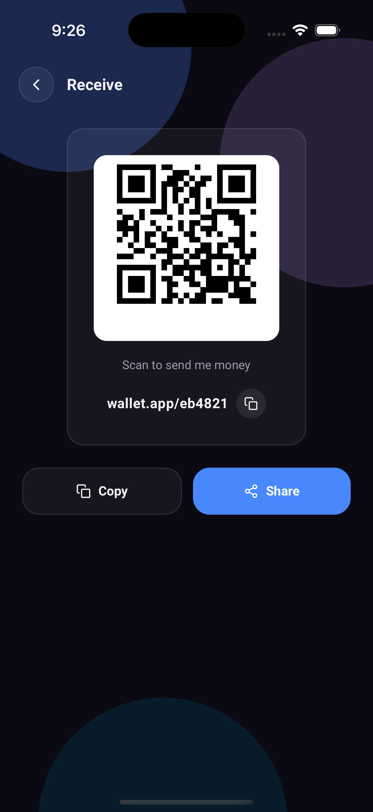

# Wallet

A minimal, glassmorphic mobile wallet built with React Native and Expo. Send, receive, and track transactions with a dark, premium fintech-inspired UI.

## Screenshots

| Home | Send | Receive |
|---|---|---|
|  |  |  |

## Features

- **Balance overview** — real-time balance display backed by shared context state
- **Send money** — recipient, amount, and optional note, with insufficient-balance handling
- **Receive money** — QR code and shareable wallet address with copy-to-clipboard
- **Transaction history** — recent activity feed with income/expense styling
- **Toast notifications** — animated in-app feedback for send confirmations and errors
- **Simulated backend** — mock async API layer to demonstrate loading states without a live server

## Tech Stack

- [React Native](https://reactnative.dev/) + [Expo](https://expo.dev/)
- [React Navigation](https://reactnavigation.org/) (native stack)
- [expo-linear-gradient](https://docs.expo.dev/versions/latest/sdk/linear-gradient/) & [expo-blur](https://docs.expo.dev/versions/latest/sdk/blur-view/) for the glassmorphism UI
- [@expo/vector-icons](https://icons.expo.fyi/) (Feather icon set)
- React Context API for global state (balance, transactions, toasts)

## Getting Started

### Prerequisites

- [Node.js](https://nodejs.org/) (LTS recommended)
- [Expo CLI](https://docs.expo.dev/get-started/installation/) (`npm install -g expo-cli`, or just use `npx`)
- The [Expo Go](https://expo.dev/client) app on your phone, or an iOS Simulator / Android Emulator set up locally

### Installation

```bash
# clone the repo
git clone https://github.com/edeiver/wallet.git
cd wallet

# install dependencies
npm install

# start the dev server
npx expo start
```

Once the dev server starts, you'll get a QR code in the terminal:

- **Physical device:** open the Expo Go app and scan the QR code (Android: in-app scanner; iOS: use the Camera app).
- **iOS Simulator:** press `i` in the terminal.
- **Android Emulator:** press `a` in the terminal.

### Running on a specific platform

```bash
npx expo start --ios       # opens iOS Simulator directly
npx expo start --android   # opens Android Emulator directly
```

## Project Structure

```
wallet/
├── components/        # Reusable UI pieces (Card, Header, ViewComponent)
├── context/            # Global state (BalanceContext, ToastContext, AuthContext)
├── screens/            # App screens (Home, Send, Receive)
├── styles/             # Design tokens and shared styles (globalStyles.js)
├── api/                # Mock API layer
└── App.js              # Navigation + provider setup
```

## Notes

This project uses a simulated API layer (`api/fakeApi.js`) to mimic asynchronous backend calls — no live server or database is required to run it locally.
